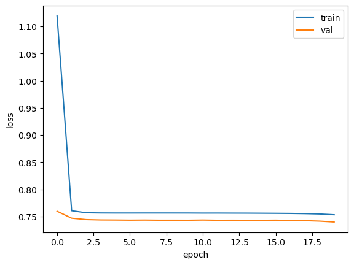
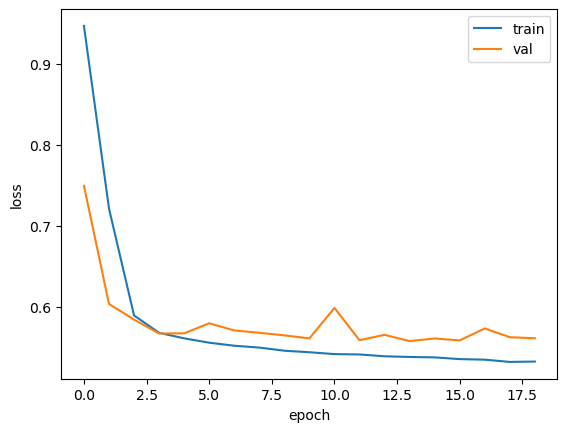
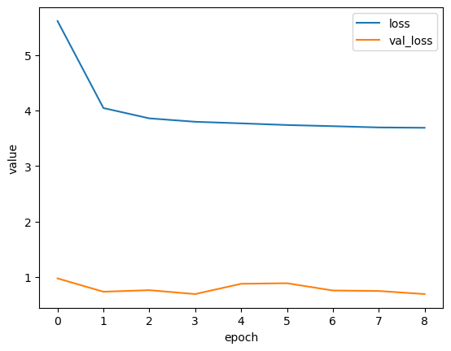

# TSI (2024년 날씨 빅데이터 컨테스트 공모)

## 수치모델 앙상블을 활용한 강수량 예측

3시간 강수량 확률(앙상블 모델들을 통해서 나온 값)을 사용하여 누적 강수량을 예측

정확한 강수량을 예측하는 회귀 분석 문제가 아닌 강수량의 정도에 따른 구간별 계급을 예측하는 분류분석 문제에 해당

### 데이터 수집

날씨마루에서 제공
- Rstudio를 통해서 HIVE에서 데이터 다운로드
    - dbGetQuery(conn, "select * from rainfall_train)
    - scv.write()
- CSV 파일로 구글 드라이브로 옮김


### 데이터 분석

 >   변수 파악

**분류 계급 10개** - 강수량이 0.1mm 미만인 경우는 따로 변수 추가 안함

<table>
<tr><td>v01</td><td>0.1mm 이상 강수</td><td>V02</td><td>0.2mm 이상 강수</td></tr>
<tr><td>v03</td><td>0.5mm 이상 강수</td><td>V04</td><td>1.0mm 이상 강수</td></tr>
<tr><td>v05</td><td>2.0mm 이상 강수</td><td>V06</td><td>5.0mm 이상 강수</td></tr>
<tr><td>v07</td><td>10.0mm 이상 강수</td><td>V08</td><td>20.0mm 이상 강수</td></tr>
<tr><td>v09</td><td>30.0mm 이상 강수</td><td></td><td></td></tr>
</table>

---

>   물리적 변수 범주화

<table>
<tr><td>TM_FC</td><td>DH, TM_EF</td></tr>
<tr>
    <td>

#### rainfall_train.fc_year
- 3년 간의 강수량임을 확인 
- B년도의 분포가 적은편

#### rainfall_train.fc_month
- 5-9월 간의 데이터

#### rainfall_train.fc_hour
- 오전 9시, 오후 9시 발표된 데이터

#### rainfall_train.stn4contest
- 총 20개 지점
- 각 지점마다 약 72000개의 데이터
    </td>
    <td>

    - DH 3의 배수를 가지며 최대 240읠 값을 가짐
    
    - <span style="align:center;font-weight:bold;">TM_EF = TM_FC + DH</span> 
    
    - 발표 시각으로 부터 몇시간 떨어져 있는지를 DH 정보가 나타내고 TM_EF는 그것을 반영한 시간입니다.
    - 발표시간이 12시간 간격임을 고려할 때 TM_EF의 값은 여러개가 됨을 알 수 있습니다.
    - 이전 발표시각에서 예측한 시간과 다음 발표시간에서 예측한 시간이 겹쳤기 때문입니다.
    - 그 예측된 시간에 따라서, 실강수량이 제시됩니다.
    ```python
    (df.groupby(by=['TM_EF','STN'])['VV'].nunique() > 2).sum()
    >> 0
    ```
    </td>
</tr>
<tr><td>(V01 - V09)</td><td>강수계급(classs_interval)</td></tr>
<tr>
<td>

- 무 강수를 제외한 누적확률 값으로 int형으로 구성
- 백분율을 기준으로 표현 되며, 각 단계별 확률을 구하기 위해서는 각 값의 차이 값을 골라야 한다.
</td>
<td>

- 10개의 클래스를 가지고 있습니다.
- 각각의 클래스는 불균형적으로 이루어져 있습니다.
- 결측치가 존재
</td>
</tr>
</table>

## 실제 훈련 데이터와 테스트 데이터 범위가 다름
- 지점(STN)과 연도(Year)의 범위가 다름

>   지점(STN)별 데이터 분포


>   연도별(Year)별 데이터 분포


### 데이터가 전체적으로 불균형(무강수/강수)


>   무강수 데이터 분포 확인

<table>
<tr><td></td><td></td></tr>
<tr><td></td><td></tr>
</table>

>  각 클래스 군별로 데이터 분포 확인


## 모델 

### 모델 검증

>   평가 방법

- 무강수 데이터의 개수: 약 84% 강수 데이터 개수 : 약 16%
- 'V0'의 크기가 큰  불균형 데이터이므로, class 별 F1 score 확인
-  $CSI = \frac{H}{H+F+M}$

### 데이터 전처리

#### max([V0-V9])를 이용한 데이터 분류

>   확률이 가장 높은 값을 클래스로 정하였을 때(:예측 모델: max([V0-V9]))

```python
from sklearn.metrics import confusion_matrix
from sklearn.metrics import classification_report
target_name = [f"V{i}"for i in range(10)]
print(classification_report(df['EF_class'],df['class'],target_names=target_name))
```
```python
              precision    recall  f1-score   support

          V0       0.94      0.88      0.91   1307439
          V1       0.00      0.05      0.01      2262
          V2       0.06      0.05      0.05     35990
          V3       0.04      0.07      0.05     16781
          V4       0.04      0.10      0.06     13705
          V5       0.17      0.15      0.16     47267
          V6       0.09      0.16      0.11     15991
          V7       0.08      0.19      0.11      8668
          V8       0.01      0.23      0.01       251
          V9       0.02      0.30      0.03       408

    accuracy                           0.81   1448762
   macro avg       0.14      0.22      0.15   1448762
weighted avg       0.86      0.81      0.83   1448762
```
>   DH 영향도 확인


```python
df.groupby(by=['TM_EF','VV'])['DH'].nunique().describe()
```
```python
count    14737.000000
mean        18.800163
std          3.582445
min          1.000000
25%         20.000000
50%         20.000000
75%         20.000000
max         20.000000
Name: DH, dtype: float64
```

> 데이터 전처리

- 월과 일의 데이터 컬럼을 합쳐서 365일을 기준으로 주기성을 넣어주기 위하여 sin 함수와 cos 함수를 사용하여 전처리
- 시간 역시 동일하게 24시간의 주기성을 넣어줌
- DH 는 MinMaxscaler를 사용하여 scale 해줌
- 각각의 확률값은 백분율에서 0~1 사이의 값으로 바꿔줌
- train 데이터와 test 데이터의 지점 데이터가 달라서 STN을 쓰지 않는다.


> 불균형 데이터 처리
<table>
<tr>
<td></td>
<td></td>
</tr>
</table>

> 불균형 데이터 처리 정리

**1. V0의 임계값을 통해 무강수/강수 분류**


**2. 랜덤포레스트 기법을 통하여 무강수/강수 분류**
>   독립변수
- DH
- V1-9
- hour: sin, cos
- day: sin, cos

>   종속변수
- class : 강수계급
- VV : 실 강수량

>   분류 결과

```python
                precision   recall    f1-score support

       False       0.69      0.45      0.55     45133
        True       0.90      0.96      0.93    244620

    accuracy                           0.88    289753
   macro avg       0.80      0.71      0.74    289753
weighted avg       0.87      0.88      0.87    289753
```

**3.DNN (가중치 설정)을 통한 분류**
```python
from tensorflow import keras
model = keras.Sequential()
model.add(keras.layers.Dense(30, activation='sigmoid',input_shape=(14,)))
model.add(keras.layers.Dense(100, activation='relu',input_shape=(35,)))
model.add(keras.layers.Dense(20, activation='relu',input_shape=(34,)))
model.add(keras.layers.Dense(1, activation='sigmoid'))
```
>   하이퍼 파라미터

- optimizer : adam
- loss_func : Cross_Entropy

>   결과


- 학습 시간이 오래 걸릴 뿐만이 아니라 오래걸림.
- DNN 보다는 머신러닝과 V0 임계값을 이용하여 데이터 분류하는 방법 사용.

> 머신러닝 분류 결과
```python
랜덤포레스트 적용
전체 데이터 개수: 1448762
분류된 무강수 데이터 개수: 1241310
분류된 무강수 중 실제 무강수 데이터 개수: 1213706
----------------------------------------
남은데이터중 데이터 무강수 개수: 9609
남은데이터중 데이터 강수 개수: 197843
남은데이터중 데이터 비율: 0.048568814666174694
```

**분류된 데이터 분포**

<table>
<tr><td>무강수 데이터</td><td></td><td>강수 데이터</td><td></td></tr>
<tr><td>class</td><td>개수</td><td>class</td><td>개수</td></tr>
<tr><td>0</td>    <td>1213706</td><td>0</td>    <td>9609</td></tr>
<tr><td>1</td>    <td>   3790</td><td>1</td>    <td>17772</td></tr>
<tr><td>2</td>    <td>   5375</td><td>2</td>    <td>28679</td></tr>
<tr><td>3</td>    <td>   4424</td><td>3</td>    <td>26268</td></tr>
<tr><td>4</td>    <td>   4229</td><td>4</td>    <td>29198</td></tr>
<tr><td>5</td>    <td>   4537</td><td>5</td>    <td>36870</td></tr>
<tr><td>6</td>    <td>   2528</td><td>6</td>    <td>25436</td></tr>
<tr><td>7</td>    <td>   1671</td><td>7</td>    <td>19497</td></tr>
<tr><td>8</td>    <td>    610</td><td>8</td>    <td>7577</td></tr>
<tr><td>9</td>    <td>    440</td><td>9</td>    <td>6546</td></tr>
</table>

## 강수 클래스 구분 모델 학습

### Random Forest

- 최적의 n_estimator 60으로 결정

> A년도 dh = 0인 데이터에 대한 모델 평가


> dh = 0인 강수 데이터에 대해서 성능 평가


>   강수데이터에 대해서 Random Forest 성능 평가 


## LSTM
### SIMPLE LSTM

```python
model = Sequential()
model.add(LSTM(25, input_shape=(x.shape[1],x.shape[2])))
model.add(Dense(10, activation="softmax"))
```

> 학습 결과


정확도,CSI 가 낮은 지점에서 수렴
```python
CSI : 0.19572919428309754
```
### DSTM_ DNN_distibuted LSTM Model

**train/test set 분리**

- 시계열 데이터의 특성상 랜덤하게 데이터를 나누는 것이 아닌 시간 순서에 따라 데이터를 구분하는 것이 필요
- B년도의 데이터를 test 데이터를 사용하는 방법 

**시계열로 데이터를 분석**

- 시계열적으로 데이터를 분석하기 위해서 2가지 변수에 따라 집계할 수 있도록 모델 설계
- STN, DH(TM_FC)

>   모델 구조
- DH 처리 : DNN
    - DH 최대 개수 : 20
    - 20* (feature 개수)로 데이터 형식을 맞춤
    - 각 열에 대해서 DNN, LSTM 등으로 feature 생성
    - 1차원으로 flatten()
- STN종류대로 시계열 데이터 셋 생성
    - STN의 종류대로 데이터를 묶음
        - 각 STN에 따라서 시간순으로 정렬된 데이터 묶음이 생성
        - STN의 개수가 20개이면 20개의 데이터 묶음이 생성된다.
    - 위에서 생성된 데이터 묶음을 timestep을 기준으로 묶습니다.

- 샘플 데이터 형식
    - DH에 따라서 구분된 데이터 : (20 * 14)
    - timestep으로 데이터를 묶음 : (5* 20 * 14)

**Default DSTM**
>   모델 구조
```python
def dstm_model(timestep=5):
    input_X = keras.layers.Input((timestep,20,14))
    process_channel = []
    for i in range(14):
        # None, timestep, 20
        channel_slice = input_X[:,:,:,i]
        process_timestep = []
        for j in range(timestep):
            #None, 20
            process = keras.layers.Dense(5,activation="sigmoid",input_shape=(20,))(channel_slice[:,j,:])
            process = keras.layers.Dense(3,activation="sigmoid",input_shape=(20,))(process)
            process_timestep.append(process)
        # (5,3)
        process_timestep = keras.layers.Concatenate()(process_timestep)
        process_channel.append(keras.layers.Reshape((timestep,3))(process_timestep))
    #(timestep,)
    X = keras.layers.Concatenate(axis=-1)(process_channel)
    X = keras.layers.Dense(30, activation="relu")(X)
    X = keras.layers.Dense(15, activation="relu")(X)
    X = keras.layers.Dense(10, activation="sigmoid")(X)
    X = keras.layers.LSTM(10,input_shape=(5,14*3))(X)
    X = keras.layers.Dense(10, activation="softmax")(X)

    lmodel = keras.Model(inputs=input_X, outputs=X)
    return lmodel
```
> 학습결과



- 모델이 local optima에 수렴한 것을 볼 수 있음

**DSTM (LSTM 전 Dense Layer 추가)**

```python
def dstm_model(timestep=5):
    input_X = keras.layers.Input((timestep,20,14))
    process_channel = []
    for i in range(14):
        # None, timestep, 20
        channel_slice = input_X[:,:,:,i]
        process_timestep = []
        for j in range(timestep):
            #None, 20
            process = keras.layers.Dense(5,activation="sigmoid",input_shape=(20,))(channel_slice[:,j,:])
            process = keras.layers.Dense(3,activation="sigmoid",input_shape=(20,))(process)
            process_timestep.append(process)
        # (5,3)
        process_timestep = keras.layers.Concatenate()(process_timestep)
        process_channel.append(keras.layers.Reshape((timestep,3))(process_timestep))
    #(timestep,)
    X = keras.layers.Concatenate(axis=-1)(process_channel)
    curr_procssing = []
    for i in range(timestep):
        curr = X[:,i,:]
        # (42,)
        curr = keras.layers.Dense(100, activation="tanh")(curr)
        curr = keras.layers.Dropout(0.2)(curr)
        curr = keras.layers.Dense(50, activation="relu")(curr)
        curr = keras.layers.Dropout(0.2)(curr)
        curr = keras.layers.Dense(24, activation="relu")(curr)
        curr = keras.layers.BatchNormalization()(curr)
        curr = keras.layers.Dense(12, activation="relu")(curr)
        curr_procssing.append(curr)
    X = keras.layers.Concatenate()(curr_procssing)
    X = keras.layers.Reshape((timestep,12))(X)
    X = keras.layers.LSTM(15,input_shape=(5,12))(X)
    X = keras.layers.Dense(10, activation="softmax")(X)

    lmodel = keras.Model(inputs=input_X, outputs=X)
    return lmodel
```
>   학습결과


- 이전보다 깊이 내려가지만 기울기가 급격히 내려가는 구간이 존재한다.
- 검증데이터는 이전과 별반 차이가 없다.

**DSTM : Return_Sequence 추가하여 LSTM layer 추가**
>   모델 구조

```python
def dstm_model(timestep=5):
    input_X = keras.layers.Input((timestep,20,14))
    process_channel = []
    for i in range(14):
        # None, timestep, 20
        channel_slice = input_X[:,:,:,i]
        process_timestep = []
        for j in range(timestep):
            #None, 20
            process = keras.layers.Dense(5,activation="sigmoid",input_shape=(20,))(channel_slice[:,j,:])
            process = keras.layers.Dense(3,activation="sigmoid",input_shape=(20,))(process)
            process_timestep.append(process)
        # (5,3)
        process_timestep = keras.layers.Concatenate()(process_timestep)
        process_channel.append(keras.layers.Reshape((timestep,3))(process_timestep))
    #(timestep,)
    X = keras.layers.Concatenate(axis=-1)(process_channel)
    curr_procssing = []
    for i in range(timestep):
        curr = X[:,i,:]
        # (42,)
        curr = keras.layers.Dense(100, activation="tanh")(curr)
        curr = keras.layers.Dropout(0.2)(curr)
        curr = keras.layers.Dense(50, activation="relu")(curr)
        curr = keras.layers.Dropout(0.2)(curr)
        curr = keras.layers.Dense(24, activation="relu")(curr)
        curr = keras.layers.BatchNormalization()(curr)
        curr = keras.layers.Dense(12, activation="relu")(curr)
        curr_procssing.append(curr)
    X = keras.layers.Concatenate()(curr_procssing)
    X = keras.layers.Reshape((timestep,12))(X)
    X = keras.layers.LSTM(50, return_sequences=True, recurrent_regularizer=keras.regularizers.l2(0.01),input_shape=(5,12))(X)
    X = keras.layers.Dropout(0.2)(X)
    X = keras.layers.LSTM(50, return_sequences=True, recurrent_regularizer=keras.regularizers.l2(0.01),input_shape=(5,12))(X)
    X = keras.layers.BatchNormalization()(X)
    X = keras.layers.LSTM(50, return_sequences=True, recurrent_regularizer=keras.regularizers.l2(0.01),input_shape=(5,12))(X)
    X = keras.layers.Dropout(0.2)(X)
    X = keras.layers.LSTM(50,recurrent_regularizer=keras.regularizers.l2(0.01),input_shape=(5,12))(X)
    X = keras.layers.BatchNormalization()(X)

    X = keras.layers.Dense(10, activation="softmax")(X)

    lmodel = keras.Model(inputs=input_X, outputs=X)
    return lmodel
```

>   학습 결과
<table><tr><td>

</td><td></td></tr>
</table>

- 성능이 낮은 위치에서 기울기가 낮아지는 수렴증상을 보임
- 학습을 더 돌려봤을 때, Valid, Train 모두 수렴하는 것으로 나타남

**D(L)STM: LSTM_LSTM 모델**

>   모델 구조

```python
def dstm_model(timestep=5):
    input_X = keras.layers.Input((timestep,20,14))
    # None, timestep, 20, 14
    channel_process = []
    for i in range(timestep):
        channel_ = input_X[:,i,:,:] 
        channel_=keras.layers.LSTM(10,return_sequences=True, recurrent_regularizer=keras.regularizers.l2(0.01),input_shape=(20,14))(channel_)
        channel_=keras.layers.LSTM(10,return_sequences=True, recurrent_regularizer=keras.regularizers.l2(0.01),input_shape=(20,10))(channel_)
        channel_=keras.layers.LSTM(10,return_sequences=True, recurrent_regularizer=keras.regularizers.l2(0.01),input_shape=(20,10))(channel_)
        channel_=keras.layers.LSTM(10, recurrent_regularizer=keras.regularizers.l2(0.01),input_shape=(20,10))(channel_)
        #output = None,1,10
        channel_process.append(channel_)
 
    #(timestep,)
    X = keras.layers.Concatenate()(channel_process)
    X = keras.layers.Reshape((timestep,10))(X)
    # None, timestep, 10
    X = keras.layers.LSTM(50, return_sequences=True, recurrent_regularizer=keras.regularizers.l2(0.01),input_shape=(timestep,10))(X)
    X = keras.layers.Dropout(0.2)(X)
    X = keras.layers.LSTM(50, return_sequences=True, recurrent_regularizer=keras.regularizers.l2(0.01),input_shape=(timestep,50))(X)
    X = keras.layers.BatchNormalization()(X)
    X = keras.layers.LSTM(50, return_sequences=True, recurrent_regularizer=keras.regularizers.l2(0.01),input_shape=(timestep,50))(X)
    X = keras.layers.Dropout(0.2)(X)
    X = keras.layers.LSTM(50,recurrent_regularizer=keras.regularizers.l2(0.01),input_shape=(timestep,50))(X)
    X = keras.layers.BatchNormalization()(X)
    X = keras.layers.Dense(10, activation="softmax")(X)
    lmodel = keras.Model(inputs=input_X, outputs=X)
    return lmodel
```
>   학습결과
<table>
<tr>
<td></td>
<td><td>
</tr>
</table>

- validation의 변동이 진동됨을 볼 수 있음.
- loss가 0.5 수준에서 과적합이 진행된다고 생각

### RBPLSTM: 무강수/강수 분류모델을 통해서 데이터 추가하는 방식
- 회귀모델: Randomforest(n_estimator=60 ,random_state=42) 
    - 독립변수: V1-9, DH, hour(sin),hour(cos),day(cos),day(sin)
    - 종속변수: VV
- 분류모델: Randomforest(n_estimator=60, random_state=42)
    - 독립변수: V1-9, DH, hour(sin),hour(cos),day(cos),day(sin)
    - 종속변수 : class
- class별로 데이터 분포에 따른 weight 줌

<table>
<tr><td style="font-weight:bold">머신러닝 알고리즘 성능</td></tr>
<tr>
<td>

    실 강수 데이터
    mean_absolute_error: 1.629823192725517
    mean_squared_error : 25.65344261132864

</td>
<td>

                precision    recall  f1-score   support
       False       0.63      0.33      0.43     90625
        True       0.86      0.96      0.91    395311
    accuracy                           0.84    485936
    macro avg       0.75      0.64      0.67    485936
    weighted avg       0.82      0.84      0.82    485936

</td>
</tr>
</table>

- 무강수/강수(분류모델을 통해서 나온 결과) 확률 추가
- Dense Latyer 층에서 실강수량(분류모델을 통해서 나온 결과) 평균 추가

>   학습 결과

<table>
<tr><td></td>
<td></td>
<td></td></tr>
</table>

**Dense 층에 머신러닝 결과를 적용**

>   모델 구조
```python
def dstm_model(timestep=5):
    input_X = keras.layers.Input((timestep,20,16))
    input_X1 = input_X[:,:,:,0:14]
    input_X2 = input_X[:,:,:,14]
    input_X3 = input_X[:,:,:,15]
    # None, timestep, 20, 14
    channel_process = []
    for i in range(timestep):
        channel_ = input_X1[:,i,:,:] 
        channel_=keras.layers.LSTM(10,return_sequences=True, recurrent_regularizer=keras.regularizers.l2(0.01),input_shape=(20,16))(channel_)
        channel_ = keras.layers.Dropout(0.2)(channel_)
        channel_=keras.layers.LSTM(10,return_sequences=True, recurrent_regularizer=keras.regularizers.l2(0.01),input_shape=(20,10))(channel_)
        channel_ = keras.layers.BatchNormalization()(channel_)
        channel_=keras.layers.LSTM(10,return_sequences=True, recurrent_regularizer=keras.regularizers.l2(0.01),input_shape=(20,10))(channel_)
        channel_ = keras.layers.Dropout(0.2)(channel_)
        channel_=keras.layers.LSTM(10, recurrent_regularizer=keras.regularizers.l2(0.01),input_shape=(20,10))(channel_)
        channel_ = keras.layers.BatchNormalization()(channel_)
        #output = None,1,10
        channel_process.append(channel_)
    X1 = keras.layers.Lambda(lambda x: tf.reduce_mean(x, axis=-1))(input_X2)
    X1 =keras.layers.Lambda(lambda x: tf.reduce_mean(x, axis=-1))(X1)
    X2 =keras.layers.Lambda(lambda x: tf.reduce_mean(x, axis=-1))(input_X3)
    X2 =keras.layers.Lambda(lambda x: tf.reduce_mean(x, axis=-1))(X2)
 
    #(timestep,)
    X = keras.layers.Concatenate()(channel_process)
    X = keras.layers.Reshape((timestep,10))(X)
    # None, timestep, 10
    X = keras.layers.LSTM(50, return_sequences=True, recurrent_regularizer=keras.regularizers.l2(0.01),input_shape=(timestep,10))(X)
    X = keras.layers.Dropout(0.2)(X)
    X = keras.layers.LSTM(50, return_sequences=True, recurrent_regularizer=keras.regularizers.l2(0.01),input_shape=(timestep,50))(X)
    X = keras.layers.BatchNormalization()(X)
    X = keras.layers.LSTM(50, return_sequences=True, recurrent_regularizer=keras.regularizers.l2(0.01),input_shape=(timestep,50))(X)
    X = keras.layers.Dropout(0.2)(X)
    X = keras.layers.LSTM(50,recurrent_regularizer=keras.regularizers.l2(0.01),input_shape=(timestep,50))(X)
    X = keras.layers.BatchNormalization()(X)
    X = keras.layers.Dense(30, activation="relu")(X)
    X = keras.layers.BatchNormalization()(X)
    X = keras.layers.Dense(15, activation="relu")(X)
    X = keras.layers.Dropout(0.2)(X)
    X = keras.layers.Dense(10, activation="relu")(X)
    X = keras.layers.BatchNormalization()(X)
    X1 =keras.layers.Reshape((1,))(X1)
    print(X1.shape)
    X2 =keras.layers.Reshape((1,))(X2)
    X = keras.layers.Concatenate(axis=-1)([X,X1,X2])
    X = keras.layers.Dense(10, activation="softmax")(X)

    lmodel = keras.Model(inputs=input_X, outputs=X)
    return lmodel
```
> 학습결과

<table>
<tr><td></td><td></td></tr>
<tr><td></td><td></td></tr>
<tr><td></td><td></td></tr>
</table>

- Dense 층에 머신러닝 결과를 적용하니, Validation과  Trainning CSI 점수가 안정적으로 0.1까지 올라감
- 0.1 이상까지 학습이 진행되지는 않음

**RBPLSTM: Regression 모델 제외**

```python
def dstm_model(timestep=5):
    input_X = keras.layers.Input((timestep,20,16))
    input_X1 = input_X[:,:,:,0:14]
    input_X2 = input_X[:,-1,-1,14]
    input_X3 = input_X[:,-1,-1,15]
    # None, timestep, 20, 14
    channel_process = []
    for i in range(timestep):
        channel_ = input_X1[:,i,:,:] 
        channel_=keras.layers.LSTM(10,return_sequences=True, recurrent_regularizer=keras.regularizers.l2(0.01),input_shape=(20,16))(channel_)
        channel_ = keras.layers.Dropout(0.2)(channel_)
        channel_=keras.layers.LSTM(10,return_sequences=True, recurrent_regularizer=keras.regularizers.l2(0.01),input_shape=(20,10))(channel_)
        channel_ = keras.layers.BatchNormalization()(channel_)
        channel_=keras.layers.LSTM(10,return_sequences=True, recurrent_regularizer=keras.regularizers.l2(0.01),input_shape=(20,10))(channel_)
        channel_ = keras.layers.Dropout(0.2)(channel_)
        channel_=keras.layers.LSTM(10, recurrent_regularizer=keras.regularizers.l2(0.01),input_shape=(20,10))(channel_)
        channel_ = keras.layers.BatchNormalization()(channel_)
        #output = None,1,10
        channel_process.append(channel_)
    X1 = keras.layers.Reshape((1,))(input_X2)
    X2 =keras.layers.Reshape((1,))(input_X3)
 
    #(timestep,)
    X = keras.layers.Concatenate()(channel_process)
    X = keras.layers.Reshape((timestep,10))(X)
    # None, timestep, 10
    X = keras.layers.LSTM(50, return_sequences=True, recurrent_regularizer=keras.regularizers.l2(0.01),input_shape=(timestep,10))(X)
    X = keras.layers.Dropout(0.2)(X)
    X = keras.layers.LSTM(50, return_sequences=True, recurrent_regularizer=keras.regularizers.l2(0.01),input_shape=(timestep,50))(X)
    X = keras.layers.BatchNormalization()(X)
    X = keras.layers.LSTM(50, return_sequences=True, recurrent_regularizer=keras.regularizers.l2(0.01),input_shape=(timestep,50))(X)
    X = keras.layers.Dropout(0.2)(X)
    X = keras.layers.LSTM(50,recurrent_regularizer=keras.regularizers.l2(0.01),input_shape=(timestep,50))(X)
    X = keras.layers.BatchNormalization()(X)
    X = keras.layers.Dense(30, activation="relu")(X)
    X = keras.layers.BatchNormalization()(X)
    X = keras.layers.Dense(15, activation="relu")(X)
    X = keras.layers.Dropout(0.2)(X)
    X = keras.layers.Dense(10, activation="relu")(X)
    X = keras.layers.BatchNormalization()(X)
    X = keras.layers.Concatenate(axis=-1)([X,X2])
    X = keras.layers.Dense(10, activation="softmax")(X)
    lmodel = keras.Model(inputs=input_X, outputs=X)
    return lmodel
```
>   학습결과


### FSTM_ Fast Data LSTM Model
- 시간당 하나의 데이터를 선별
- 해당 시간 중 가장 dh가 작은 데이터를 사용


DH가 작을수록 데이터의 신뢰성이 높아진다는 것을 가설로 함.

```python
def dstm_model(timestep=5):
    input_X = keras.layers.Input((timestep,20,14))
    process_channel = []
    for i in range(14):
        # None, timestep, 20
        channel_slice = input_X[:,:,:,i]
        process_timestep = []
        for j in range(timestep):
            #None, 20
            process = keras.layers.Dense(10,activation="sigmoid",input_shape=(20,))(channel_slice[:,j,:])
            process = keras.layers.Dense(5,activation="relu",input_shape=(50,))(process)
            process = keras.layers.Dense(3,activation="sigmoid",input_shape=(20,))(process)
            process_timestep.append(process)
        # (5,3)
        process_timestep = keras.layers.Concatenate()(process_timestep)
        process_channel.append(keras.layers.Reshape((timestep,3))(process_timestep))
    #(timestep,)
    X = keras.layers.Concatenate(axis=-1)(process_channel)
    X = keras.layers.Dense(30, activation="relu")(X)
    X = keras.layers.Dense(15, activation="relu")(X)
    X = keras.layers.LSTM(15,input_shape=(5,14*3))(X)
    X = keras.layers.Dense(10, activation="softmax")(X)

    lmodel = keras.Model(inputs=input_X, outputs=X)
    return lmodel
```
> 학습 결과

<table>
<tr><td></td>
<td></td>
<td></td></tr>
</table>

**머신러닝 결과 후처리**

>   모델 구조

```python
def fstm_model(timestep=5):
    #(None,Timestep,26)
    input_X = keras.layers.Input((timestep,16))
    input_X1 = input_X[:,:,0:14]
    input_X2 = input_X[:,-1,14]
    input_X3 = input_X[:,-1,15]
    X2 = keras.layers.Reshape((1,))(input_X2)
    X3 = keras.layers.Reshape((1,))(input_X3)
    # None, timestep, 20, 14
    X = keras.layers.LSTM(70,return_sequences=True, recurrent_regularizer=keras.regularizers.l2(0.01),input_shape=(timestep,14))(input_X1)
    X = keras.layers.Dropout(0.2)(X)
    X = keras.layers.LSTM(70,return_sequences=True, recurrent_regularizer=keras.regularizers.l2(0.01),input_shape=(timestep,70))(X)
    X = keras.layers.BatchNormalization()(X)
    X = keras.layers.LSTM(70,return_sequences=True, recurrent_regularizer=keras.regularizers.l2(0.01),input_shape=(timestep,70))(X)
    X = keras.layers.Dropout(0.2)(X)
    X = keras.layers.LSTM(70, recurrent_regularizer=keras.regularizers.l2(0.01),input_shape=(timestep,70))(X)
    X = keras.layers.BatchNormalization()(X)
    X = keras.layers.Concatenate()([X,X2,X3])
    X = keras.layers.Dense(10, activation="softmax")(X)
    lmodel = keras.Model(inputs=input_X, outputs=X)
    return lmodel
```

>   학습결과


- 머신러닝 결과를 적용해도 학습이 잘 되지는 않음


**FSTM: 기술지표 데이터 추가**

>   모델 구조

```python
def fstm_model(timestep=5):
    #(None,Timestep,26)
    input_X = keras.layers.Input((timestep,24))
    input_X1 = input_X[:,:,0:22]
    input_X2 = input_X[:,-1,22]
    input_X3 = input_X[:,-1,23]
    X2 = keras.layers.Reshape((1,))(input_X2)
    X3 = keras.layers.Reshape((1,))(input_X3)
    # None, timestep, 20, 14
    X = keras.layers.LSTM(70,return_sequences=True, recurrent_regularizer=keras.regularizers.l2(0.01),input_shape=(timestep,14))(input_X1)
    X = keras.layers.Dropout(0.2)(X)
    X = keras.layers.LSTM(70,return_sequences=True, recurrent_regularizer=keras.regularizers.l2(0.01),input_shape=(timestep,70))(X)
    X = keras.layers.BatchNormalization()(X)
    X = keras.layers.LSTM(70,return_sequences=True, recurrent_regularizer=keras.regularizers.l2(0.01),input_shape=(timestep,70))(X)
    X = keras.layers.Dropout(0.2)(X)
    X = keras.layers.LSTM(70, recurrent_regularizer=keras.regularizers.l2(0.01),input_shape=(timestep,70))(X)
    X = keras.layers.BatchNormalization()(X)
    X = keras.layers.Concatenate()([X,X2])
    X = keras.layers.Dense(50, activation="relu")(X)
    X = keras.layers.Dropout(0.2)(X)
    X = keras.layers.Dense(25, activation="relu")(X)
    X = keras.layers.BatchNormalization()(X)
    X = keras.layers.Concatenate()([X,X3])
    X = keras.layers.Dense(10, activation="softmax")(X)
    lmodel = keras.Model(inputs=input_X, outputs=X)
    return lmodel
```

>   학습 결과


- 기술 지표 추가시 데이터가 0으로 맞춰지는 현상 발생
- 따로 기술 지표를 추가한지 않는 방향

### TSTM Teaching LSTM 

- 학습이 제대로 이루어지지 않고 있다고 판단
- Encoder-Decoder의 Teaching 개념을 사용하여 모델을 설계
- 뒷부분의 LSTM의 각 단계에서 입력 값으로 정답 데이터를 주고 학습
- 어느 정도 학습이 되었다고 판단되었을 때, encoder의 학습을 멈추고 Decoder layer을 encoder output으로 학습
- 회귀모델(종속변수: 실강수량)으로 설계
    - scaling을 StandardScaler를 사용할 때, 모든 값이 0으로 되는 현상발생
    - minmax sclaer를 사용하기에는 각 연도별, min-max 값의 편차가 심함
    - 스케일링 없이 진행

**encode_decode 모델**

```python
from tensorflow import keras
timestep=5
input_X = keras.layers.Input((timestep,20,15))
input_Y = keras.layers.Input((timestep,1))
#각 DH 마다의 가중치에 따라 feature 생성
unit = 1
channel_process = []

# 인코딩 과정
for i in range(timestep):
    _channel = keras.layers.Lambda(lambda x : x[:,i,:,:])(input_X)
    _channel = keras.layers.LSTM(100, input_shape=(20,15))(_channel)
    channel_process.append(_channel)
encode_X = keras.layers.Concatenate()(channel_process)
encode_X = keras.layers.Reshape((timestep,100))(encode_X)
encode_X = keras.layers.LSTM(100, return_sequences=True, input_shape=(timestep,))(encode_X)
encode_X = keras.layers.LSTM(50, return_sequences=True, input_shape=(timestep,))(encode_X)
encode_X = keras.layers.LSTM(10, return_sequences=True, input_shape=(timestep,))(encode_X)
encode_out,h,c = keras.layers.LSTM(1, return_sequences=True, return_state=True, input_shape=(timestep,))(encode_X)
# 디코딩 과정
d_h = keras.layers.Reshape((1,))(h[:,-1])
d_c = keras.layers.Reshape((1,))(c[:,-1])
d_o = keras.layers.Reshape((1,1))(encode_out[:,0])
encode_state = [d_h,d_c]
# 비교 (timestep, 10)
DX = keras.layers.Concatenate(axis=1)([d_o,input_Y[:,:-1]])
decoder_lstm = keras.layers.LSTM(unit, return_sequences=True)
DX = decoder_lstm(DX,initial_state=encode_state)
DX = keras.layers.Flatten()(DX)
```
>   학습 결과

- 회귀 모델로는 전혀 학습되지 않음을 볼 수 있다.
- decoder의 복잡하지 않은 모델가 회귀 데이터의 다양한 범위를 반영하지 못하는것으로 판단

### cluster-bassd machine learning model
- 데이터의 분포를 나눠서 머신러닝으로 분류하도록 하는 알고리즘

>   프로세스
1. 비슷한 데이터 분포를 띄는 것끼리 데이터를 나눔
2. 나눠진 각 클러스터 마다 앙상블 모델(랜덤 포레스트 적용)

#### 클러스터 나누기
- 별개의 시간과 장소에 대한 데이터만 남기도록 데이터를 전처리
    - dh가 가장 작은 것으로 판단
- DBSCAN을 사용하려고 하였지만, 데이터의 크기가 커서 커널이 죽음

**최소 dh 데이터 분포**
```

```

- 다수의 독립변수(V0-V9,day,hour)를 하나의 종 벡터로 간주
- 각 데이터간의 거리를 계산 후 거리를 기반으로 데이터 클러스터를 나눈다.
- 실루엣 점수를 계산
$s(i) = \frac{b(i) - a(i)}{max(a(i),b(i))}$
    - b(i)는 가장 가까운 군집과의 평균거리
    - a(i)는 동일한 군집내에서의 평균 거리
    - 개별 군집에서 전체 실루엣 계수가 클 수록 성능이 우수
    - 군집 내 개별 요소들의 실루엣 점수가 비슷해야지 성능이 좋다.

>   학습결과

**train data 군집화**


**test data 군집화**


**train data csi 점수**

```python
0th cluster csi score : 0.12154793315743184
1th cluster csi score : 0.7101200686106347
2th cluster csi score : 0.7320261437908496
3th cluster csi score : 0.7373737373737373
```
**test data csi 점수**

```python
0th cluster csi score : 0.002157829839704069
1th cluster csi score : 0.0
2th cluster csi score : 0.000970873786407767
3th cluster csi score : 0.00906344410876133
```
- 훈련데이터와 테스트 데이터에 대해서 일치하지 않음
- 일반적인 데이터의 분포를 모델이 학습하지 못하고 있음
- LogisticRegression과 같은 간단한 모델로 학습시 train 데이터와 test 데이터 둘 다에서 0점밖에 나오지 않음
- **군집화를 한 상태에서 각각의 데이터를 나눴을 때, 데이터 분포를 설명하기 위해서 모델은 복잡해야 하지만, Overfitting 되는 현상 발생**


