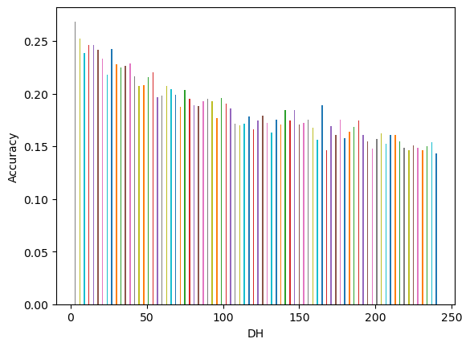
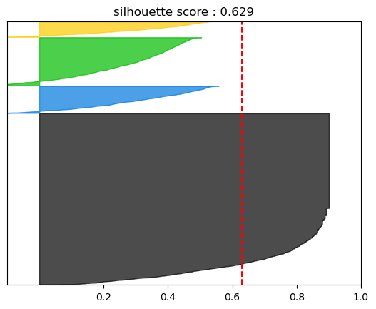

## 년도, 지점별 데이터 분석 
<table>
<tr>
    <td></td>
    <td></td>
</tr>
</table>

- 실제 훈련 데이터와 테스트 데이터 범위가 다름
- 모델에서 지점과 년도가 얼마나 영향을 미칠지 분석

> 평균 데이터 분석

지점, 년도에 따른 강수 계급에 해당하는 값을 평균한 값을 통하여, 전체적인 경향성 분석

>   연도별(Year)별 데이터 분포

- **데이터 시각화를 통해서 지점별로는 비교적 유사한 데이터 분포를 띄고, 연도별로는 비교전 다른 데이터 분포 패턴을 띄고 있음**

## 클래스 계급별 데이터 분석

### 전체 계급별 강수 데이터 분석

### 년도/지점 강수 계급 데이터 분석

<table>
 <tr><td></td><td></td></tr>
</table>

## 데이터가 전체적으로 불균형(무강수/강수)

<table>
<tr><td></td>
<td> </td></tr>
</table>

- 무강수 데이터의 개수: 약 84% 강수 데이터 개수 : 약 16%
- 무강수 데이터를 제외한 데이터에 대해서 비교적 데이터 분포가 균형잡혀 있음

### 지점별 강수 클래스 데이터 분포

### 년도별 강수 클래스 데이터 분포

### 지점/년도별 강수 클래스 데이터 분포

## 월에 따른 강수 계급 분포

<table>
<tr><td></td><td></td></tr>
</table>

## DH 영향도 확인

dh 변수가 예측 결과 값에 주는 영향도를 분석하기 위해서,  
V0(무강수 확률), V1-9(각 강수 계급별 확률) 중 최대 값을 가지는 계급을 예측 계급으로 하는 **max(V0-9)모델**을 사용.

<table>
<tr>
<td></td>
<td></td>
</tr>
</table>

- **dh가 낮을 수록 데이터의 신뢰도가 높아짐**

### Accuracy

### 조건부 결과: 강수 데이터라고 가정하였을 때

<table>
<tr><td></td><td> </td></tr>
</table>

## 전체적인 학습 데이터 설명
- 3년 간의 강수량이며, A,C년도는 약 488,000개, B년도 데이터는 상대적으로 조금 적은 약 480,000개를 가지고 있었다.
- 오전 9시, 오후 9시 마다 발표된 시간을 기준으로는 5-9월까지의 데이터를 가짐
- 실제 예측 시간으로는 5-10월간의 데이터로, 10월의 데이터는 이전 달에 비해서 상당히 적은 양임
- 총 20개의 지점에서 관측된 데이터이며, 각 지점마다 약 72,000개의 데이터를 가짐

## 년도별 최소dh 값 분석**

- dh가 15이상인 지점 이후의 데이터는 A,B,C,D 데이터 모두에서 적은값으로 관측됨
- D년도의 데이터가 상당히 작은 량을 보여주는데, 20개의 지점에서 관측한 데이터를 지니고 있는 데이터와 달리 Test에서는 5개의 지점만을 가지고 있기 때문으로 확인

## 각 지점에 대한 정답값의 형태 분포

- DBSCAN을 사용하려고 하였지만, 데이터의 크기가 커서 커널이 죽음
- 다수의 독립변수(V0-V9,day,hour)를 하나의 종 벡터로 간주
- 각 데이터간의 거리를 계산 후 거리를 기반으로 데이터 클러스터를 나눈다.
- 실루엣 점수를 계산
$s(i) = \frac{b(i) - a(i)}{max(a(i),b(i))}$
    - b(i)는 가장 가까운 군집과의 평균거리
    - a(i)는 동일한 군집내에서의 평균 거리
    - 개별 군집에서 전체 실루엣 계수가 클 수록 성능이 우수
    - 군집 내 개별 요소들의 실루엣 점수가 비슷해야지 성능이 좋다.

### train data 군집화

### test data 군집화 

- 4개로 분포의 형태가 나눠짐을 확인

## V_median 점수에 대한 고찰

>   일자에 따라 각 년도별 평균값 비교

<table>
<tr>
<td></td>
<td></td>
<td></td>
</tr>
</table>

>   일자에 따른 C년도 각 지점별 평균값 비교

