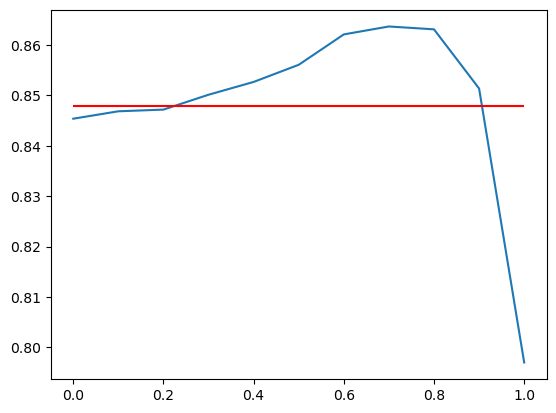
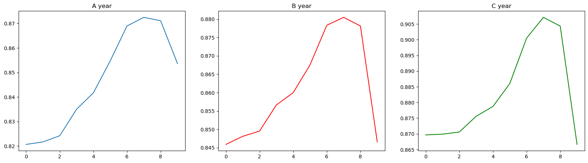
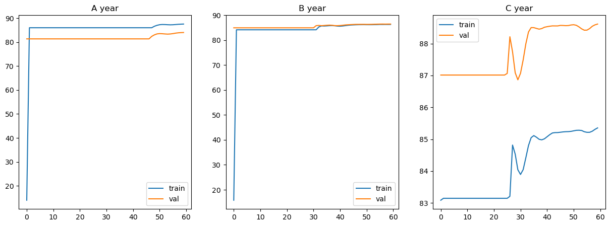

## 무강수/강수 분류 모델

### argMax 모델
- 전체 데이터에 대해서 각 계급별 확률이 가장 높은 것으로 추정: 약 0.848
- 종속변수에 대응되는 다수의 데이터로 보깅

- 0.7로 보깅시 0.863 정도로 이전보다 더 높은 확률로 추정함을 확인


### 랜덤포레스트 모델
- 학습데이터 A,B,C년도에 대해서 각각 교차 검증하여 성능을 판단했다.
- 전체 데이터에 대해서는 다음과 같은 결과가 나왓다.
- A : 0.832, B: 0.85, C: 0.867

**보팅 알고리즘 사용시**

- 0.7의 가중치를 사용할 때, 가장 좋은 성능을 보였다.
- A: 0.872, B: 0.880, C: 0.907


### DNN (가중치 설정)을 통한 분류**
>   하이퍼 파라미터

- optimizer : adam
- loss_func : Binary Cross_Entropy

>   결과



**A,B,C년도에 대해서 교차검증 결과** 
```
A: 84.240 
B: 86.695 
C: 88.737
```

**0.7 가중치 보팅**
```
A: 86.921
B: 87.760
C: 89.901
```


> 머신러닝 분류 결과
```python
랜덤포레스트 적용
전체 데이터 개수: 1448762
분류된 무강수 데이터 개수: 1241310
분류된 무강수 중 실제 무강수 데이터 개수: 1213706
----------------------------------------
남은데이터중 데이터 무강수 개수: 9609
남은데이터중 데이터 강수 개수: 197843
남은데이터중 데이터 비율: 0.048568814666174694
```

**분류된 데이터 분포**

<table>
<tr><td>무강수 데이터</td><td></td><td>강수 데이터</td><td></td></tr>
<tr><td>class</td><td>개수</td><td>class</td><td>개수</td></tr>
<tr><td>0</td>    <td>1213706</td><td>0</td>    <td>9609</td></tr>
<tr><td>1</td>    <td>   3790</td><td>1</td>    <td>17772</td></tr>
<tr><td>2</td>    <td>   5375</td><td>2</td>    <td>28679</td></tr>
<tr><td>3</td>    <td>   4424</td><td>3</td>    <td>26268</td></tr>
<tr><td>4</td>    <td>   4229</td><td>4</td>    <td>29198</td></tr>
<tr><td>5</td>    <td>   4537</td><td>5</td>    <td>36870</td></tr>
<tr><td>6</td>    <td>   2528</td><td>6</td>    <td>25436</td></tr>
<tr><td>7</td>    <td>   1671</td><td>7</td>    <td>19497</td></tr>
<tr><td>8</td>    <td>    610</td><td>8</td>    <td>7577</td></tr>
<tr><td>9</td>    <td>    440</td><td>9</td>    <td>6546</td></tr>
</table>

## 강수 클래스 구분 모델 학습

### Random Forest

- 최적의 n_estimator 60으로 결정

> A년도 dh = 0인 데이터에 대한 모델 평가


> dh = 0인 강수 데이터에 대해서 성능 평가


>   강수데이터에 대해서 Random Forest 성능 평가 


### cluster-bassd machine learning model
- 데이터의 분포를 나눠서 머신러닝으로 분류하도록 하는 알고리즘

>   프로세스
1. 비슷한 데이터 분포를 띄는 것끼리 데이터를 나눔
2. 나눠진 각 클러스터 마다 앙상블 모델(랜덤 포레스트 적용)

### 클러스터 나누기
- 별개의 시간과 장소에 대한 데이터만 남기도록 데이터를 전처리
    - dh가 가장 작은 것으로 판단